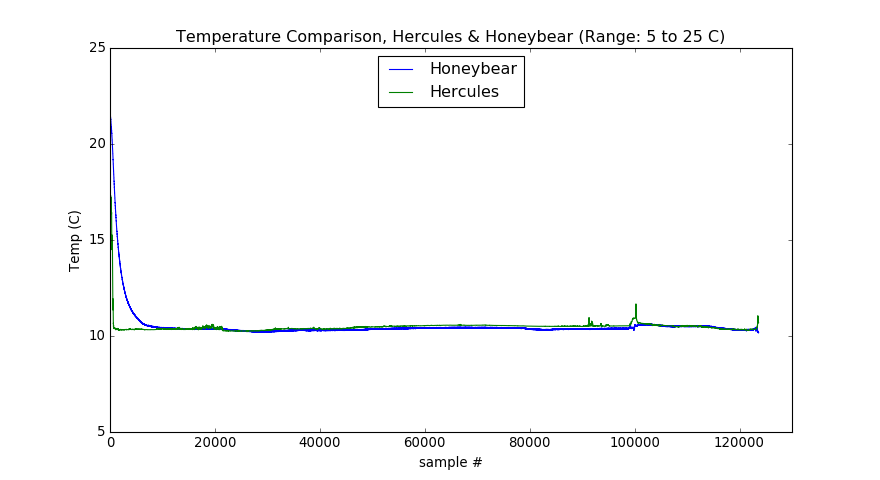
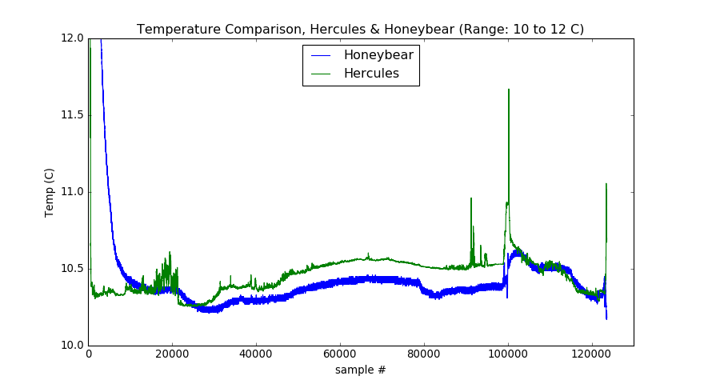

# nautilus-honeybear

## Overview

This repository contains a Jupyter <a href="index.ipynb">notebook</a> comparing temperature probe data from Hercules and Honeybear on dive H1547 during <a href="http://nautiluslive.org">Nautilus</a> expedition NA075.

To try the notebook out 'live', click <a href="http://mybinder.org:/repo/dwblair/nautilus-honeybear">here</a>.

(To rebuild the Binder instance, click [here](http://mybinder.org/status/dwblair/nautilus-honeybear).
