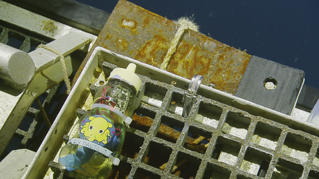
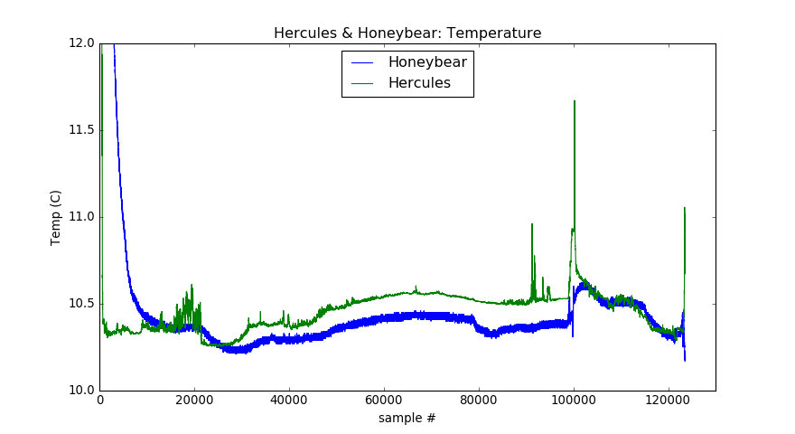

# nautilus-honeybear

This repository contains a Jupyter <a href="index.ipynb">notebook</a> comparing temperature probe data from Hercules and Honeybear on dive H1547 during Nautilus expedition NA075:

